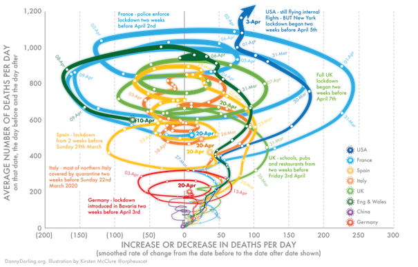
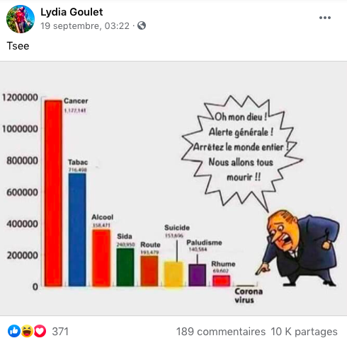
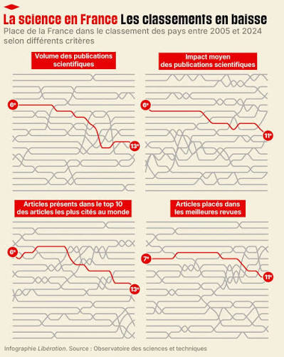

La première visualisation est difficile à comprendre car le temps n’est pas directement représenté et les courbes en boucle peuvent donner une fausse impression de cycles ou de causalité.
Les pays sont aussi comparés avec des nombres absolus de décès ce qui les rend peu comparables compte tenu de leurs différences de population.
Pour l’améliorer, il aurait été préférable d’utiliser les décès par million d’habitants, de mettre le temps sur l’axe horizontal et de simplifier les courbes et annotations.

Le graphique est trompeur car il compare des causes de décès avec des échelles et des périodes qui ne sont pas clairement précisées tout en présentant le coronavirus comme presque inexistant.
Il utilise aussi un message très alarmiste et émotionnel (« nous allons tous mourir ») ce qui influence l’interprétation des données plutôt que de les présenter objectivement.
Pour l’améliorer, il faudrait préciser les sources et les périodes, utiliser des données comparables et actuelles et adopter une présentation neutre sans éléments destinés à provoquer une réaction émotionnelle.

La ligne rouge représentant la France est difficile à suivre à cause de toutes les lignes grises des autres pays, qui rendent le graphique assez confus et n’apportent pas vraiment d’informations. 
L’axe des années manque aussi de repères intermédiaires donc on ne peut pas bien voir à quel moment la baisse se produit ni 
si elle est progressive ou soudaine. On aurait pu garder seulement 2 ou 3 pays en comparaison, comme la Chine, l’Allemagne et les États-Unis
et ajouter des repères chaque année pour rendre la tendance plus facile à comprendre.

