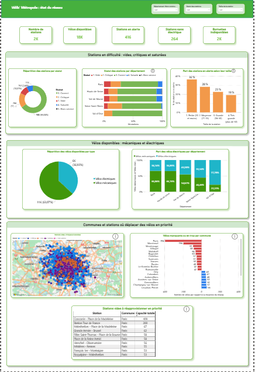

Vélib' Métropole : état du réseau

Ce tableau de bord Power BI analyse la disponibilité des vélos en libre-service Vélib' à Paris et dans les communes voisines. 
Il s'appuie sur les données ouvertes de Vélib'.
Nous nous sommes placés du point de vue des équipes qui déplacent les vélos des stations pleines vers les stations vides. 
Le tableau de bord répond à une question : où le service est-il dégradé, et où faut-il déplacer des vélos en priorité ?
Pour y répondre, nous avons donné un statut à chaque station : vide quand il n'y a aucun vélo, critique quand il en reste un 
ou deux, saturée quand il reste deux places libres ou moins et correct dans les autres cas.
Nous avons organisé la page en trois parties. La première montre les stations en difficulté, par département et selon leur 
taille. La deuxième montre la répartition entre vélos mécaniques et vélos électriques. La troisième indique où agir avec une 
carte des stations à problème, le nombre de vélos manquants ou en trop par commune et la liste des grandes stations vides à 
réapprovisionner. Des filtres permettent de choisir un département, une commune, un statut ou une taille de station.
Le tableau de bord montre que le principal problème est le manque de vélos : 416 stations sont vides ou critiques,
contre 113 saturées. Les petites stations sont les plus touchées, puisque 36 % d'entre elles sont en alerte,
contre 19 % des très grandes. Le réseau est aussi déséquilibré entre les communes : il manque environ 200 vélos à Montreuil,
alors que Boulogne-Billancourt en a environ 300 de trop. Enfin, 37 % des vélos disponibles sont électriques, avec une part
plus forte en Seine-Saint-Denis qu'à Paris.
Comme les données correspondent à un seul moment, le tableau de bord ne montre pas l'évolution dans la journée ou dans la
semaine.

